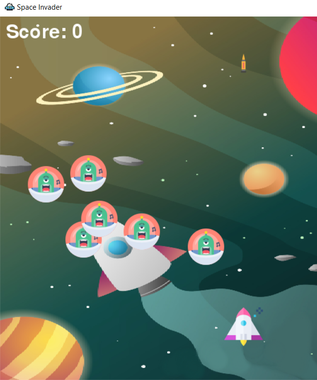

# Arcade-Shooter

## Installation
    cd Arcade-Shooter
    mkvirtualenv Arcade-Shooter
    pip3 install pygame
    python main.py

## Usage
    Use arrow keys up, down, left, right to move your spaceship accordingly.
    Press space to shoot a bullet.
    Fight against enemy spacecrafts and aim for highest score.
    Enjoy the game!
